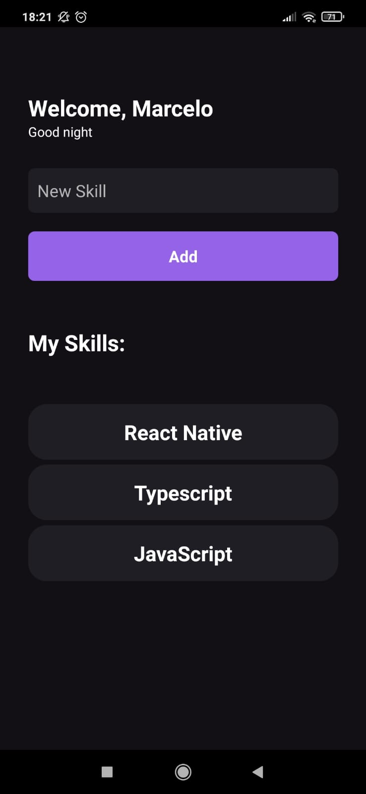

# Hello and Welcome to my first React Native Project!

Its a "myskills" app, to create a list of skills and remove itens if necessary.
Created with React Native CLI, using initially a pure JavaScript and refactored with TypeScript.

<h3 align="center">My App Screen</h3>

  

This project have 1 page.
The status bar style is locked in all project with barStyle="light-content" placed in App.tsx for better visualization.

The useEffect is used in a welcome text, before the input, to set the greeting based on what time the app was opened.

The list is a FlatList, created using useState.

The app has a function to remove items of the list, with a touch in the item who you wish to remove.

## If you have some questions or a feedback about the code or me, feel free to contact me!

